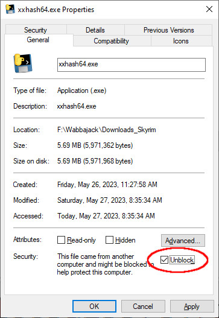

# checksum

`xxHash` is an Extremely fast, non cryptographic Hash algorithm by Yann Collet and used by Wabbajack.  
https://github.com/Cyan4973/xxHash  

I used pyinstaller to make a Windows 10 xxhash64.exe inside the xxhash64.zip file.  
https://pypi.org/project/xxhash/  

Just place `xxhash64.exe` in same directory with the downloaded archives then run it.  
note: you probably need to '[unblock](unblock.jpg)' it after downloading the zip. 

The program options are:  
```
  xxhash64.exe -l -s
    -s sort the filenames descending by size  
    -l use append to create a log  
       note: you may want to delete the log before you re-run the program  
```
# sample output
```
F:\Wabbajack\Downloads_Skyrim>xxhash64.exe -s
...........
f51cfd431560f2c0    1.0GB Northfires Windhelm-44099-1-1610046665.rar
.
33fe1f43a6a340f0    2.1MB Chisel 1K-47534-1-0-1616687625.7z
.
26692bf09d2c365b    2.1MB Blackreach Sun-40045-1-4-1609918363.7z
```

xxhash64.exe MD5 File Checksum is: cb166ba233fc4fd94626e59f67761b9b  
https://emn178.github.io/online-tools/md5_checksum.html  




